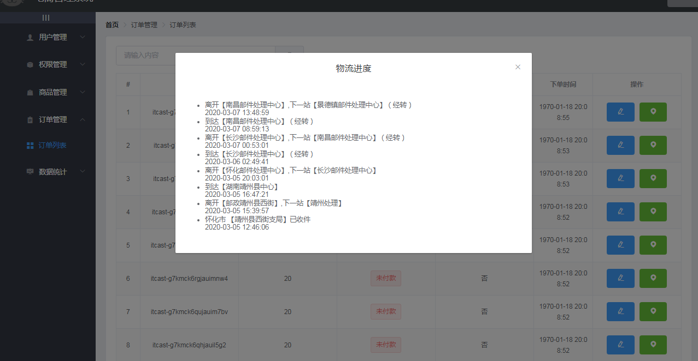
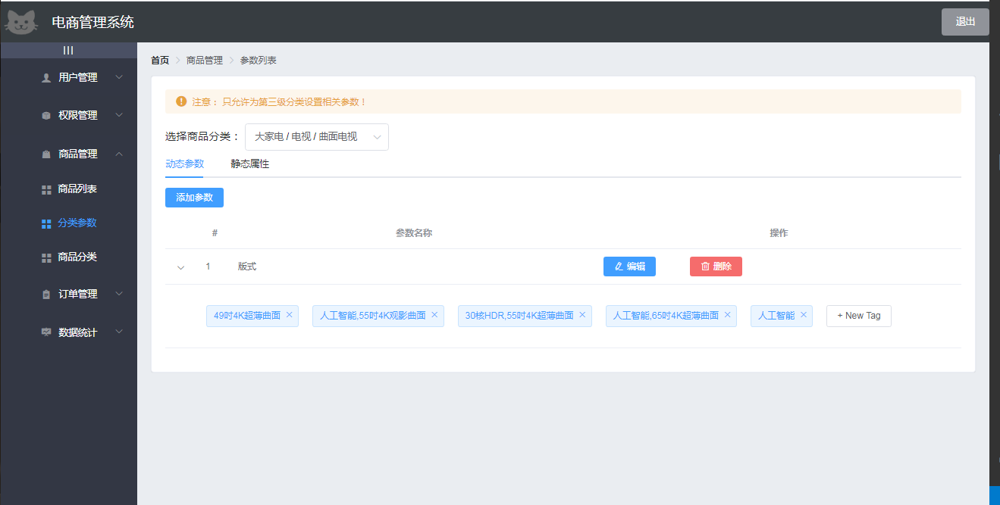
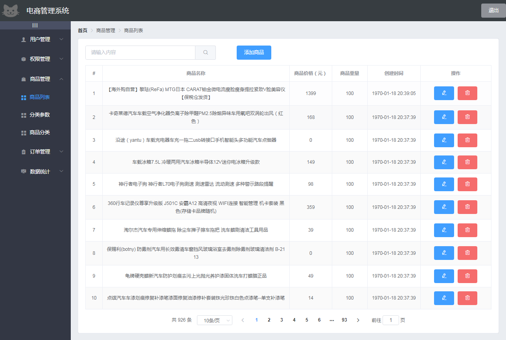

# vueshop后台管理系统

# 技术选型
| 技术 | 说明 | 官网 |
| ---- | ---- | ---- |
| Vue	| 前端框架 |	https://vuejs.org/ |
| Vue-router | 路由框架|https://router.vuejs.org/ |
| Vuex | 全局状态管理框架	| https://vuex.vuejs.org/ |
| Element |	前端UI框架 | https://element.eleme.io/ |
| E-charts | 图表框架 | https://www.echartsjs.com/zh/index.html |
| vue-quill-editor | 富文本编辑器 | https://github.com/surmon-china/vue-quill-editor |
| nprogress | 进度条控件 | https://github.com/rstacruz/nprogress |

# 项目布局
src源码目录
—— components 页面
  - Goods 商品管理
    + Add 添加商品
    + Cate 商品分类
    + List 商品列表
    + Params 参数列表
  - Home 主页
  - Login 登录页面
  - Order 订单页面
  - Report 数据统计
  - Rights 权限管理
    + 权限列表
    + 角色列表
  - User 用户管理
  - Welcome 欢迎页面
—— plugins 插件
  - timeline 时间轴
  - timeline-item
  - element.js 按需导入Element
—— assets 静态图片资源文件

# 功能计划
- 系统登录：token方式
- 用户管理：新建用户、删除用户、修改用户
- 商品管理：添加商品、商品列表、商品分类、商品参数列表
- 订单管理： 订单编号、订单价格、是否发货、下单时间、物流进度
- 权限管理：新建角色、查看角色、编辑角色、删除角色、分配权限
- 数据统计: 用户来源
 
# 项目优化
- chainWebpack自定义打包入口
- 通过webpack的externals加载外部CDN资源
- 按需导入/CDN导入Element UI
- 首页html根据模式渲染标题和CDN加载
- 通过@babel/plugin-syntax-dynamic-import实现路由懒加载

# 安装教程
1. 该项目为前后端分离项目，访问本地访问接口需搭建后台环境，后台项目vue-shop-server:https://gitee.com/wBekvam/vueShop-api-server.git
2. clone项目到本地，然后npm install --> npm run serve

# 项目效果
## 登录界面

## 欢迎界面

## 角色列表界面

## 权限列表界面

## 订单列表界面

## 用户管理界面

## 商品分类界面

## 商品参数界面
静态参数

动态参数

## 商品列表界面

## 商品添加界面
商品基本信息

商品参数

商品属性

商品图片

商品内容

## 数据报表界面

## production模式下包大小
